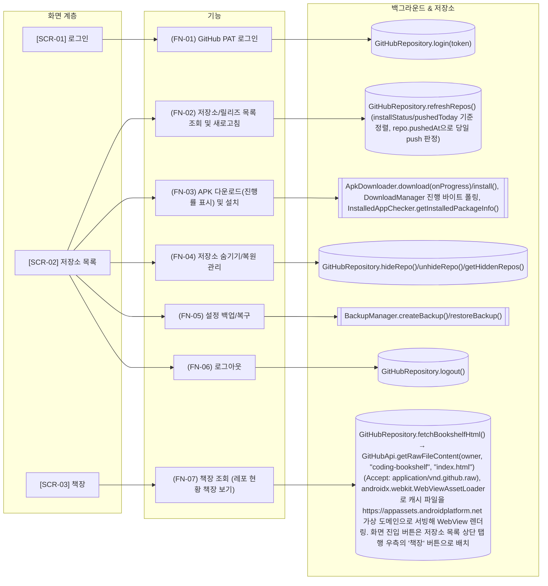

# 화면/기능 구조 (ARCHITECTURE)

## 변경 사항 (이번 실행)

- 갱신: FN-02, FN-03, FN-04, FN-05, FN-07, SCR-02

## 1. 메뉴/화면 계층 트리

- **SCR-01** 로그인
- **SCR-02** 저장소 목록
- **SCR-03** 책장

## 2. 화면-기능 연계 상세 표

| 화면 ID | 화면명 | 기능 ID | 연동 데이터/API | 개발 목적 (Why) |
|---|---|---|---|---|
| SCR-01 | 로그인 | FN-01 | GitHubRepository.login(token) | GitHub Personal Access Token으로 인증하여 내 저장소와 star/watch 저장소의 릴리즈를 확인할 수 있게 함 |
| SCR-02 | 저장소 목록 | FN-02 | GitHubRepository.refreshRepos() (installStatus/pushedToday 기준 정렬, repo.pushedAt으로 당일 push 판정) | 로그인한 사용자의 소유/Star/Watch 저장소별 최신 릴리즈와 설치 상태를 보여주며, 첫 화면에 진입할 때마다(ON_START) 자동 새로고침해 항상 최신 상태를 유지함. 목록을 NEW/UPDATE/ALL 탭으로 나눠 설치 필요·업데이트 필요 저장소를 구분해서 보여주고(대상 있으면 탭에 'NEW(3)'처럼 개수 표시), 오늘 push된 저장소는 정렬 최상단에 올리고 카드에 '오늘 업데이트' 배지로 표시함 |
| SCR-02 | 저장소 목록 | FN-03 | ApkDownloader.download(onProgress)/install(), DownloadManager 진행 바이트 폴링, InstalledAppChecker.getInstalledPackageInfo() | 새 릴리즈 또는 업데이트가 있는 저장소의 APK 에셋을 다운로드하고 바로 설치할 수 있게 하며, 카드에 진행률 바(%/용량)를 보여줘 다운로드 현황을 확인하고 중복 다운로드를 막음 |
| SCR-02 | 저장소 목록 | FN-04 | GitHubRepository.hideRepo()/unhideRepo()/getHiddenRepos() | 관심 없는 저장소를 관리 목록에서 숨기고, 필요 시 숨긴 저장소를 다시 복원할 수 있게 함 |
| SCR-02 | 저장소 목록 | FN-05 | BackupManager.createBackup()/restoreBackup() | 감시 대상 저장소 설정을 텍스트 파일로 백업하고 복구할 수 있게 함 |
| SCR-02 | 저장소 목록 | FN-06 | GitHubRepository.logout() | GitHub 인증 토큰을 지우고 로그인 화면으로 돌아가게 함 |
| SCR-03 | 책장 | FN-07 | GitHubRepository.fetchBookshelfHtml() → GitHubApi.getRawFileContent(owner, "coding-bookshelf", "index.html") (Accept: application/vnd.github.raw), androidx.webkit.WebViewAssetLoader로 캐시 파일을 https://appassets.androidplatform.net 가상 도메인으로 서빙해 WebView 렌더링. 화면 진입 버튼은 저장소 목록 상단 탭 행 우측의 '책장' 버튼으로 배치 | PC(~/coding)에서 shelf.py가 만드는 저장소 현황 책장(BOOKSHELF.html)을 앱에서도 바로 볼 수 있게 함. 비공개 저장소 이름/커밋 이력이 담겨 있어 공개 GitHub Pages 대신 비공개 저장소(coding-bookshelf)에 두고, 기존 GitHub PAT 로그인 토큰으로 Contents API를 통해 비공개로 조회함. file:// 스킴으로 캐시 파일을 직접 로드하면 최신 WebView에서 net::ERR_ACCESS_DENIED가 발생해 WebViewAssetLoader 가상 도메인 방식으로 교체함 |

## 3. 지식 그래프 (Mermaid)

