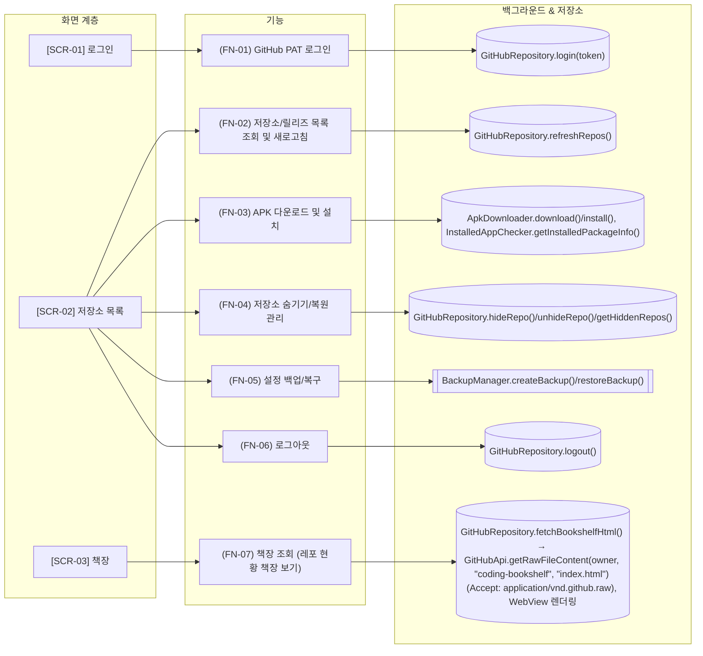

# 화면/기능 구조 (ARCHITECTURE)

## 변경 사항 (이번 실행)

- 추가: SCR-03, FN-07

## 1. 메뉴/화면 계층 트리

- **SCR-01** 로그인
- **SCR-02** 저장소 목록
- **SCR-03** 책장

## 2. 화면-기능 연계 상세 표

| 화면 ID | 화면명 | 기능 ID | 연동 데이터/API | 개발 목적 (Why) |
|---|---|---|---|---|
| SCR-01 | 로그인 | FN-01 | GitHubRepository.login(token) | GitHub Personal Access Token으로 인증하여 내 저장소와 star/watch 저장소의 릴리즈를 확인할 수 있게 함 |
| SCR-02 | 저장소 목록 | FN-02 | GitHubRepository.refreshRepos() | 로그인한 사용자의 소유/Star/Watch 저장소별 최신 릴리즈와 설치 상태를 보여줌 |
| SCR-02 | 저장소 목록 | FN-03 | ApkDownloader.download()/install(), InstalledAppChecker.getInstalledPackageInfo() | 새 릴리즈 또는 업데이트가 있는 저장소의 APK 에셋을 다운로드하고 바로 설치할 수 있게 함 |
| SCR-02 | 저장소 목록 | FN-04 | GitHubRepository.hideRepo()/unhideRepo()/getHiddenRepos() | 관심 없는 저장소를 관리 목록에서 숨기고, 필요 시 숨긴 저장소를 다시 복원할 수 있게 함 |
| SCR-02 | 저장소 목록 | FN-05 | BackupManager.createBackup()/restoreBackup() | 감시 대상 저장소 설정을 텍스트 파일로 백업하고 복구할 수 있게 함 |
| SCR-02 | 저장소 목록 | FN-06 | GitHubRepository.logout() | GitHub 인증 토큰을 지우고 로그인 화면으로 돌아가게 함 |
| SCR-03 | 책장 | FN-07 | GitHubRepository.fetchBookshelfHtml() → GitHubApi.getRawFileContent(owner, "coding-bookshelf", "index.html") (Accept: application/vnd.github.raw), WebView 렌더링 | PC(~/coding)에서 shelf.py가 만드는 저장소 현황 책장(BOOKSHELF.html)을 앱에서도 바로 볼 수 있게 함. 비공개 저장소 이름/커밋 이력이 담겨 있어 공개 GitHub Pages 대신 비공개 저장소(coding-bookshelf)에 두고, 기존 GitHub PAT 로그인 토큰으로 Contents API를 통해 비공개로 조회함 |

## 3. 지식 그래프 (Mermaid)

